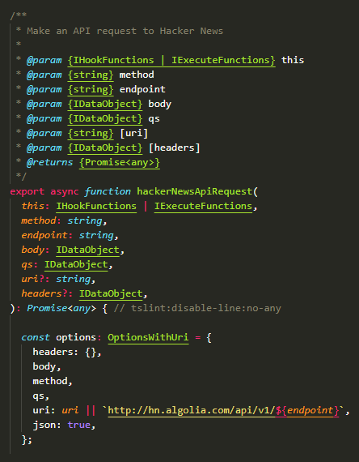
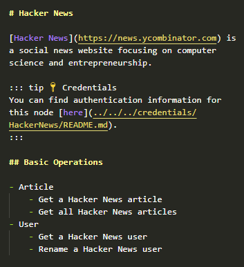
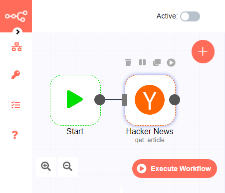
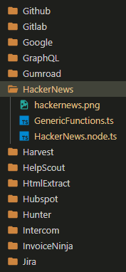

<p align="center">
  
</p>

<p align="center">
  <h1 align="center">Nodemaker</h1>
</p>

<p align="center">
  Desktop app and CLI utility to auto-generate n8n nodes<br/>
  by <a href='https://github.com/ivov'>Iván Ovejero</a> and <a href='https://github.com/erin2722'>Erin McNulty</a>
</p>

<p align="center">
  <a href="#installation">Installation</a> •
  <a href="#operation">Operation</a> •
  <a href="/docs/output-examples">Examples</a> •
  <a href="/docs/cli-reference.md">Documentation</a>
</p>

<p align="center">
  
  <a href="https://github.com/MLH-Fellowship"></a>
  
</p>

<br/>

**Nodemaker** is an automatic node generator for [n8n](https://github.com/n8n-io/n8n), a workflow automation tool. Nodemaker outputs all functionality and documentation files for a node, places them in the official repos, and uploads a sample workflow to [n8n.io](https://n8n.io/workflows).

Developed as a **desktop app** and **CLI utility**, in MVP stage, as a capstone project for the [MLH Fellowship](https://github.com/MLH-Fellowship).

<br/>

<p align="center">
    
    &nbsp;&nbsp;&nbsp;&nbsp;
    
    &nbsp;&nbsp;&nbsp;&nbsp;
    
    &nbsp;&nbsp;&nbsp;&nbsp;
    
</p>

<p align="center">
  Built with <b>TypeScript</b>, <b>Node</b>, <b>Electron</b> and <b>Vue</b>
</p>

## Installation

To install Nodemaker:

```sh
git clone https://github.com/MLH-Fellowship/nodemaker.git
npm i
cd client && npm i
```

To quickly see it working:

```sh
cd .. # return to root dir
npm run nodegen
```

With `nodegen`, Nodemaker will read the sample params in `parameters.ts` and generate a set of sample output files in `/output`.

## Operation

Nodemaker can be operated as a desktop app or as a CLI utility.

- To run the desktop app: `npm run desktop`
- To run the CLI, see the [CLI reference](/docs/cli-reference.md).

Nodemaker generates two types of files:

**Node functionality files**

- `*.node.ts` — main logic (regular or trigger node)
- `GenericFunctions.ts` — node helper functions
- `*Description.ts` — separate logic per resource (optional)
- `*.credentials.ts` — node authentication params
- `package.json` — updated node listing
- `*.png` — node icon

|   |
| :------------------------------------------------------------------------------: |
|            Excerpts of `HackerNews.node.ts` and `GenericFunctions.ts`            |

<br />

**Node documentation files**

- `README.md` — main doc file
- `README.md` — credentials doc file
- `workflow.png` — in-app screenshot for main doc file

|   |
| :-------------------------------------------------------------------------------: |
|                  Excerpt of main `README.md` and `workflow.png`                   |

<br />

Once these files are generated, Nodemaker can:

- relocate them in your copies of the [n8n](https://github.com/n8n-io/n8n) and [n8n-docs](https://github.com/n8n-io/n8n-docs) repos, and
- submit a sample workflow to the [n8n.io](https://n8n.io/workflows) collection.

|    |
| :----------------------------------------------------------------------------------------------------------------: |
| Node TypeScript files placed in `n8n` repo and automated workflow submission on [n8n.io](https://n8n.io/workflows) |

## Authors

© 2020 Iván Ovejero and Erin McNulty

## License

Distributed under the MIT License. See [LICENSE.md](LICENSE.md)
